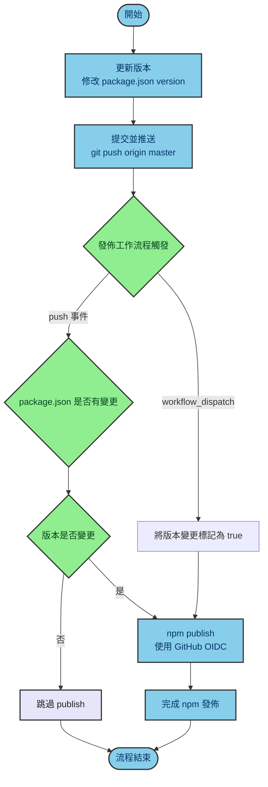

# git-setup

本工具會全自動設定 Git 版控環境，並且跨平台支援 Windows, Linux, macOS 等作業系統的命令列環境，尤其針對中文環境經常會出現亂碼的問題都會完美的解決。

## 先決條件

- [Node.js](https://nodejs.org/en/) 10.13.0 以上版本
- [Git](https://git-scm.com/) 任意版本 (建議升級到最新版)

## 使用方式

```sh
npx @willh/git-setup
```

或者直接指定名稱與 Email:

```sh
npx @willh/git-setup --name "Your Name" --email your.email@example.com
```

或者使用互動模式，逐項確認每個設定：

```sh
npx @willh/git-setup -i
```

- 設定過程會詢問你的 `user.name` 與 `user.email` 資訊
  - 如果在命令列中使用 `--name` 與 `--email` 參數，則不會詢問
  - Email 會進行格式驗證，格式錯誤會拒絕設定下去
- 所有 Git 設定都會以 `--global` 為主 (`~/.gitconfig`)
- Windows 平台會自動設定 `LC_ALL` 與 `LANG` 使用者環境變數
  - Linux, macOS 平台會提醒進行設定
- 使用 `-i` 或 `--interactive` 參數可進入互動模式
  - 每個設定會逐一詢問是否要執行
  - 可按 `y` 確認執行、`n` 跳過該設定、`q` 離開程式

## 設定內容

若為 Windows 平台，請記得使用 Command Prompt 執行以下命令，並跳過 Linux/macOS 專屬的命令。

```sh
git config --global user.name  ${name}
git config --global user.email  ${email}

# 設定打錯命令時 3 秒內會自動做出判斷
git config --global help.autocorrect 30

# 推送新分支時自動設定上游分支
git config --global push.autoSetupRemote true

# 設定預設分支名稱為 main
git config --global init.defaultBranch main

# 統一使用 LF 作為行尾字元，避免跨平台協作時的問題
git config --global core.autocrlf input
git config --global core.safecrlf false

# 為了能正確顯示 UTF-8 中文字
git config --global core.quotepath false

# 在命令列環境下自動標示顏色
git config --global color.diff auto
git config --global color.status auto
git config --global color.branch auto

# 常用的 Git Alias 命令
git config --global alias.ci   commit
git config --global alias.cm   "commit --amend -C HEAD"
git config --global alias.co   checkout
git config --global alias.st   status
git config --global alias.sts  "status -s"
git config --global alias.br   branch
git config --global alias.re   remote
git config --global alias.di   diff
git config --global alias.type "cat-file -t"
git config --global alias.dump "cat-file -p"
git config --global alias.lo   "log --oneline"
git config --global alias.ls   "log --show-signature"
git config --global alias.ll   "log --pretty=format:'%h %ad | %s%d [%Cgreen%an%Creset]' --graph --date=short"
git config --global alias.lg   "log --graph --pretty=format:'%Cred%h%Creset %ad |%C(yellow)%d%Creset %s %Cgreen(%cr)%Creset [%Cgreen%an%Creset]' --abbrev-commit --date=short"
git config --global alias.alias "config --get-regexp ^alias\."
# 顯示建議的 .gitattributes 檔案內容（此 alias 由本工具自動設定，詳見下方說明）

# 必須是 Windows 平台才會執行以下設定
git config --global alias.ignore "!gi() { curl -sL https://www.gitignore.io/api/$@ ;}; gi"
git config --global alias.iac "!giac() { git init -b main && git add . && git commit -m 'Initial commit' ;}; giac"
git config --global alias.liac "!gliac() { hash=$(pwd | { if command -v md5 >/dev/null 2>&1; then md5; else md5sum | awk '{print $1}'; fi; }); repo=\"$HOME/.git-repos/$hash\"; mkdir -p \"$repo\" && printf '%s\n' \"$(pwd)\" > \"$repo/OriginalWorkingTreePath\" && git init --separate-git-dir \"$repo\" && cd \"$(pwd)\" ;}; gliac"
git config --global alias.acp "!gacp() { git add . && git commit --reuse-message=HEAD --amend && git push -f ;}; gacp"
git config --global alias.aca "!gaca() { git add . && git commit --reuse-message=HEAD --amend ;}; gaca"
git config --global alias.cc  "!grcc() { git reset --hard && git clean -fdx ;}; read -p 'Do you want to run the <<< git reset --hard && git clean -fdx >>> command? (Y/N) ' answer && [[ $answer == [Yy] ]] && grcc"

# 必須是 Linux/macOS 平台才會執行以下設定
git config --global alias.ignore '!'"gi() { curl -sL https://www.gitignore.io/api/\$@ ;}; gi"
git config --global alias.iac '!'"giac() { git init -b main && git add . && git commit -m 'Initial commit' ;}; giac"
git config --global alias.liac '!'"gliac() { hash=\$(pwd | { if command -v md5 >/dev/null 2>&1; then md5; else md5sum | awk '{print \$1}'; fi; }); repo=\"\$HOME/.git-repos/\$hash\"; mkdir -p \"\$repo\" && printf '%s\n' \"\$(pwd)\" > \"\$repo/OriginalWorkingTreePath\" && git init --separate-git-dir \"\$repo\" && cd \"\$(pwd)\" ;}; gliac"
git config --global alias.acp '!'"gacp() { git add . && git commit --reuse-message=HEAD --amend && git push -f ;}; gacp"
git config --global alias.aca '!'"gaca() { git add . && git commit --reuse-message=HEAD --amend ;}; gaca"
git config --global alias.cc  '!'"grcc() { git reset --hard && git clean -fdx ;}; read -p 'Do you want to run the <<< git reset --hard && git clean -fdx >>> command? (Y/N) ' answer && [[ $answer == [Yy] ]] && grcc"

# 必須是 Windows 平台且有安裝 TortoiseGit 才會設定 tlog 這個 alias
git config --global alias.tlog "!start 'C:\\PROGRA~1\\TortoiseGit\\bin\\TortoiseGitProc.exe' /command:log /path:."

# 必須是 Windows 平台才會將預設編輯器設定為 notepad
git config --global core.editor notepad
```

## 其他調整建議

1. `core.editor`

    在選擇 `git commit` 所使用的文字編輯器時，每個人都有不同的偏好，但是 Git 預設的 `vim` 應該是大多數人不熟悉的，所以這個工具的預設會選擇 `notepad` (記事本) 為主要編輯器，這是因為在 Windows 作業系統上，這是唯一所有人都有的應用程式，不需要額外安裝。

    如果你想調整用 Visual Studio Code 作為預設編輯器，可以執行以下指令：

    ```sh
    git config --global core.editor "code --wait"
    ```

    如果習慣用 Visual Studio Code Insider 版本，可以執行以下指令：

    ```sh
    git config --global core.editor "code-insiders --wait"
    ```

2. `core.autocrlf` 與 `core.safecrlf`

    本工具採用跨平台統一的行尾字元處理方式，設定 `core.autocrlf=input` 與 `core.safecrlf=false`。

    - `core.autocrlf=input`：將工作目錄中的 CRLF 轉換為 LF 後存入版本庫，檢出時保持 LF 不變
    - `core.safecrlf=false`：不檢查混合行尾字元，避免因工具差異而阻擋提交

    由於現在大多數 Windows 編輯器都已經能正確處理 LF 字元，這樣的設定可以確保：
    - 版本庫內所有文字檔都使用 LF 行尾（跨平台一致）
    - 降低因不同平台的行尾字元造成的 diff 問題
    - 配合 `.gitattributes` 可以更精確控制特定檔案的行尾處理

    如果需要啟用嚴格檢查（拒絕混合行尾字元），可以執行：

    ```sh
    git config --global core.autocrlf input
    git config --global core.safecrlf true
    ```

3. `pull.rebase`

    在 `git pull` 時，預設會使用 `merge` 的方式合併分支，但是有些人習慣使用 `rebase` 的方式合併分支，這樣可以讓歷史紀錄更加乾淨，不會有多餘的合併紀錄。

    如果你想調整為 `rebase` 的方式，可以執行以下指令：

    ```sh
    git config --global pull.rebase true
    ```

4. `push.autoSetupRemote`

    本工具已將 `push.autoSetupRemote` 設為 `true`，這樣在推送新分支時，Git 會自動設定上游分支，不再需要手動使用 `--set-upstream` 或 `-u` 選項。

    例如，當你建立新分支並首次推送時：

    ```sh
    git checkout -b feature/new-feature
    git commit -m "Add new feature"
    git push  # 自動設定上游分支，不需要 git push -u origin feature/new-feature
    ```

5. `alias.ac` - AI 自動產生 commit 訊息

    此工具會自動設定 `git ac` 命令,當你的工作目錄有變更時,它會:
    - 自動偵測是否有已暫存 (staged) 的變更,若無則自動執行 `git add -A`
    - 以 `scripts/alias-ac.full.sh` 作為主要實作來源，並透過 `scripts/build-ac.js` 壓縮為 `dist/alias-ac.min.sh` 嵌入 alias
    - 顯示已排除的檔案清單（刪除的檔案、壓縮檔案、lock 檔案）
    - 顯示納入 AI 分析的檔案清單（新增、修改、重新命名的檔案）
    - 呼叫 `aichat` 工具分析 diff 內容
    - 使用 AI 產生符合 Conventional Commits 1.0.0 格式的繁體中文 commit 訊息
    - 自動執行 commit 並顯示最近一次的 commit log

    當變更檔案內容過長時，會改用「精簡上下文」策略：改送出變更檔案清單與統計資料給 aichat，降低輸入量並保證可順利產生 commit。

    **前置需求**: 需要先安裝 [aichat](https://github.com/sigoden/aichat) 命令列工具

    **排除規則**:
    - 刪除的檔案 (不納入 AI 分析,但會列出檔名)
    - 壓縮檔案,如 `*.min.js`、`*.min.css`、`*.bundle.js` 等 (不納入 AI 分析,但會列出檔名)
    - Lock 檔案,如 `package-lock.json`、`yarn.lock`、`pnpm-lock.yaml`、`Bun.lock`、`bun.lockb`、`Gemfile.lock`、`Cargo.lock`、`composer.lock`、`Podfile.lock`、`poetry.lock`、`Pipfile.lock`、`packages.lock.json`、`pubspec.lock`、`mix.lock`、`go.sum` 等 (不納入 AI 分析,但會列出檔名)

    ```sh
    # 使用範例
    git ac  # 自動分析變更並產生 commit 訊息
    ```

5. `alias.undo` - 撤銷上一次 commit

    此工具會自動設定 `git undo` 命令,可快速撤銷上一次的 commit,但保留所有變更:

    ```sh
    git undo  # 等同於 git reset HEAD~
    ```

    這個命令會:
    - 撤銷最後一次 commit
    - 保留所有檔案變更 (變更會回到 unstaged 狀態)
    - 適合用於修正 commit 訊息或重新整理變更

6. `alias.liac` - 使用分離 Git 目錄初始化目前目錄

    此工具會自動設定 `git liac` 命令,可在目前目錄初始化 Git repository,並將實際 Git 目錄放在 `~/.git-repos/` 底下:

    ```sh
    git liac
    ```

    這個命令會:
    - 建立 `~/.git-repos` 目錄
    - 以目前路徑的雜湊值作為分離 Git 目錄名稱
    - 執行 `git init --separate-git-dir ~/.git-repos/<hash>`
    - 建立 `OriginalWorkingTreePath` 檔案，內容為工作目錄的原始完整路徑

    macOS 會使用 `md5` 產生雜湊值; 若環境沒有 `md5`,會改用 `md5sum`。

## Makefile 指令

本專案新增 `Makefile`，可集中管理常用指令：

- `make help`：顯示可用指令
- `make install`：安裝依賴套件
- `make start`：執行 CLI（相當於 `npm run start`）
- `make build`：建置 `git ac` 壓縮腳本到 `dist/alias-ac.min.sh`
- `make build-ac`：直接執行 `npm run build-ac`
- `make bump`：執行 patch 版號遞增並更新 `package-lock.json`
- `make clean`：移除建置輸出
- `make status`：查看 git 變更狀態
- `make version`：顯示目前套件版本

### 發佈流程

**目前發佈流程採用「版號變更 → 推送 master」的自動觸發，並由 GitHub Actions 進行版本檢查後決定是否執行 `npm publish`。**

目前有兩種觸發方式：

- 自動流程：`master` 分支上 `package.json` 有變更時推送
- 手動流程：在 GitHub Actions 使用 `Run workflow` 觸發 `workflow_dispatch`

流程如下：



**關鍵檢查點**

- `.github/workflows/publish.yml` 會檢查版本是否變更；未變更時流程結束，不會 publish。
- `npm publish` 在 CI 中會先執行 `prepublishOnly`，會自動觸發 `npm run build`，產生最新 `dist/alias-ac.min.sh`。
- 流程使用 `permissions.id-token: write`，採用 Trusted Publishing，不需手動設定 `NPM_TOKEN`。
- `workflow_dispatch` 會直接發佈（跳過版本比較），供臨時手動發佈使用。
- `PUBLISH.md` 仍保留手動發佈備援：`npm publish --provenance --access public`。

7. `alias.attributes` - 顯示建議的 .gitattributes 檔案內容

    此工具會自動設定 `git attributes` 命令,可快速查看本工具建議的 `.gitattributes` 檔案內容:

    ```sh
    git attributes  # 顯示建議的 .gitattributes 內容
    ```

    使用範例:

    ```sh
    # 直接將內容輸出到 .gitattributes 檔案
    git attributes > .gitattributes
    
    # 或先查看內容
    git attributes
    ```

## .gitattributes 設定建議

為了更精確地控制檔案的行尾字元處理，建議在專案根目錄建立 `.gitattributes` 檔案：

```txt
# --- 基本：自動偵測文字檔並正規化至 LF（倉庫內） ---
* text=auto

# --- 一致化 LF（跨平台工具與 CI 友善） ---
*.sh         text eol=lf
*.bash       text eol=lf
*.zsh        text eol=lf
*.fish       text eol=lf
Makefile     text eol=lf
Dockerfile   text eol=lf
.dockerignore text eol=lf
.editorconfig text eol=lf
.gitattributes text eol=lf
.gitignore   text eol=lf
*.md         text eol=lf
*.txt        text eol=lf
*.json       text eol=lf
*.jsonc      text eol=lf
*.yaml       text eol=lf
*.yml        text eol=lf
*.toml       text eol=lf
*.ini        text eol=lf
*.cfg        text eol=lf
*.properties text eol=lf
*.env        text eol=lf
*.rc         text eol=lf

# 程式碼檔案
*.c          text eol=lf
*.h          text eol=lf
*.cpp        text eol=lf
*.hpp        text eol=lf
*.cc         text eol=lf
*.cs         text eol=lf
*.go         text eol=lf
*.java       text eol=lf
*.kt         text eol=lf
*.kts        text eol=lf
*.js         text eol=lf
*.jsx        text eol=lf
*.ts         text eol=lf
*.tsx        text eol=lf
*.mjs        text eol=lf
*.cjs        text eol=lf
*.py         text eol=lf
*.rb         text eol=lf
*.php        text eol=lf
*.rs         text eol=lf
*.swift      text eol=lf
*.m          text eol=lf
*.mm         text eol=lf
*.scala      text eol=lf
*.r          text eol=lf
*.pl         text eol=lf
*.lua        text eol=lf
*.gradle     text eol=lf

# 標記與前端相關
*.css        text eol=lf
*.scss       text eol=lf
*.less       text eol=lf
*.html       text eol=lf
*.xhtml      text eol=lf
*.xml        text eol=lf
*.svg        text eol=lf

# --- Windows 專用腳本與專案檔案：檢出時使用 CRLF ---
*.bat        text eol=crlf
*.cmd        text eol=crlf
*.ps1        text eol=crlf
*.sln        text eol=crlf
*.vcxproj    text eol=crlf
*.vcproj     text eol=crlf
*.csproj     text eol=crlf
*.vbproj     text eol=crlf
*.props      text eol=crlf
*.targets    text eol=crlf

# --- 二進位檔案：停用行尾與 diff ---
# 影像
*.png  binary
*.jpg  binary
*.jpeg binary
*.gif  binary
*.webp binary
*.ico  binary
*.psd  binary
*.ai   binary
*.eps  binary

# 影音
*.mp3  binary
*.wav  binary
*.flac binary
*.ogg  binary
*.mp4  binary
*.mov  binary
*.avi  binary
*.mkv  binary

# 字型
*.ttf  binary
*.otf  binary
*.woff binary
*.woff2 binary

# 文件與試算表
*.pdf  binary
*.doc  binary
*.docx binary
*.xls  binary
*.xlsx binary
*.ppt  binary
*.pptx binary

# 壓縮與封裝
*.zip  binary
*.7z   binary
*.rar  binary
*.gz   binary
*.bz2  binary
*.tar  binary
*.jar  binary
*.apk  binary
*.ipa  binary

# 執行檔與目標檔
*.exe  binary
*.dll  binary
*.pdb  binary
*.so   binary
*.dylib binary
*.a    binary
*.lib  binary
*.o    binary

# 資料庫與快取
*.sqlite binary
*.db     binary

# --- 降噪：縮小無意義 diff ---
*.min.js -diff
*.min.css -diff
*.map    -diff

# --- 選用：Git LFS（如已啟用，再解除註解） ---
#*.psd filter=lfs diff=lfs merge=lfs -text
#*.mp4 filter=lfs diff=lfs merge=lfs -text
#*.zip filter=lfs diff=lfs merge=lfs -text

# --- 選用：打包時不包含開發輔助檔 ---
#/.github        export-ignore
#/.gitignore     export-ignore
#/.gitattributes export-ignore
#/.editorconfig  export-ignore
```

### 使用方式

- **新專案**

    將上述檔案加入後直接提交，版本庫內會以 LF 正規化文字行尾，檢出時依規則輸出 LF 或 CRLF。

- **既有專案**

    加入 `.gitattributes` 後，執行以下命令套用正規化並提交一次性變更：

    ```sh
    git add --renormalize .
    git commit -m "chore: normalize line endings via .gitattributes"
    ```

## 提供建議

如果您對本工具有任何想法，歡迎到[這裡](https://github.com/doggy8088/git-setup/issues)留言討論！

## 作者資訊

- **Will 保哥**
- 部落格：https://blog.miniasp.com
- 粉絲團：https://www.facebook.com/will.fans
- 線上課程：https://learn.duotify.com

## 相關連結

- [2.7 Git 基礎 - Git Aliases](https://git-scm.com/book/zh-tw/v2/Git-%E5%9F%BA%E7%A4%8E-Git-Aliases)
- [Creating CLI Executable global npm module](https://medium.com/@thatisuday/creating-cli-executable-global-npm-module-5ef734febe32)
